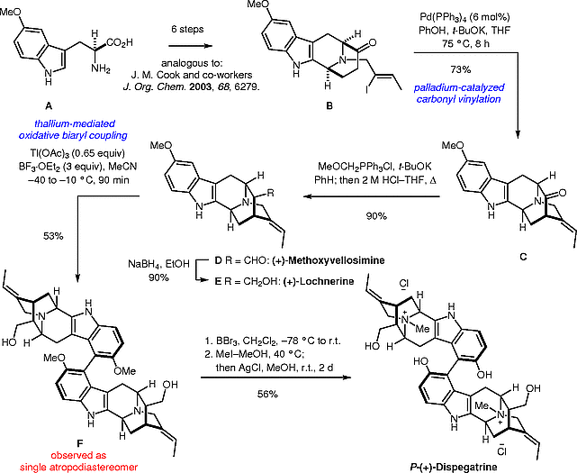
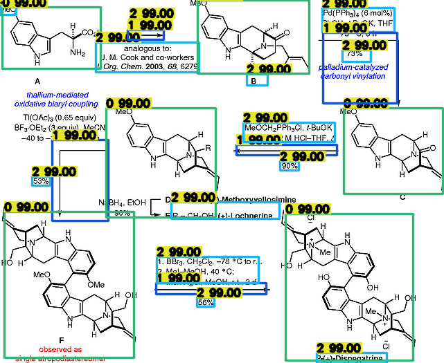

<p align="center">
  <a>
    
  </a>

  <p align="center">
    Digitize your chemical reaction image into a machine-readable representation.
    <br>
    <a>V.0</a>
    ·
    <a href="https://www.zurich.ibm.com">IBM Research Zurich</a>
  </p>
</p>

##
<p align="center">
  <a>
    
  </a>
</p>

## Table of contents

- [Description](#Description)
- [Step by step](#step-by-step)
- [Installation](#installation)
- [Contributing](#contributing)
- [Creators](#creators)
- [Thanks](#thanks)
- [Citing](#citing)


## Description
From a chemical reaction image, detect and classify molecules, text and arrows by using a Vision Transformer (DETR). The detections are then translated into text "OCR" or into SMILES. The direction of the reaction is detected and preserved into the output file.

Output:

```text
Reaction X

SMILES:
C=Cc1ccc2[nH]cc(C[C@H](N)C(=O)OF)c2c1>>C/C=C(\\C)CN1C2CCC(=O)[C@]1(C)Cc1c2[nH]c2ccc(C)cc12.O>>molecule8>>molecule5>>BCc1ccc2[nH]c3c(c2c1-c1c(O)ccc(C)c1C1=C(C)C2CC4/C(=C\\C)CN2C(C1)C4CC)CC1C(CC)C24CC3N1[C@@H]2/C4=C/C.C.CC=O.CC=O>>C=C1CC2(C#N)C3(C)CC1C1CCNC12CC1=C3Cc2ccc(C)c(-c3c([O-])ccc4[nH]c5c(c34)CC3C[C@H]4C5(C)CC(C)([C@@H](C)CCO)C34CC3CC3)c21
```

## Step by step
### 1 - Objects detection - ViT
A DETR model with a ResNet50 backbone is used to detect the objects in the image. Classes to be found = ["molecules","arrows","text", "+ symbols"]. Images of type "png" are feed as input and bounding boxes corresponding to the objects locations in a tensor type as well as its respective label are the returned outputs. 
##### Input Image
<p align="center">
  <a>
    
  </a>
</p>

##### Detections
<p align="center">
  <a>
    
  </a>
</p>

##### Training Dataset
Syntetic Dataset consisting of 50k images that are randomly created to simulate the real-world reactions publications distribution.

##### Training Parameters
* Learning Rate: 1e-4
* Learning Rate Backbone: 1e-5
* Learning Rate Drop: 22 epochs
* Weight Decay: 1e-5
* Epochs: 30
* Clip Max. Norm.: 0.1
* Dropout: 0.1

##### Multi Head Self-Attention
<p align="center">
  <a>
    
  </a>
</p>

### 2 - OCR
OCR model from DocTr library was trained on chemical-related data generated from US chemical patents. To come up with the training data set, the Text Recognition Data Generator tool was used. The resulting weights were used to extract textual information from text detections.

### 3 - MolVec
Towards recognizing the information present in the molecule objects detected, we utilized the open-access user interface MolVec.

## Output Files
```json
{
    "arrow11": {
        "prev_mol": "CCCC#N.CCCC[Al](CC(C)C)CC(C)C",
        "text": ["-duction of nit-ile", "Coordination of nitrog- pair to the ilum-"],
        "post_mol": "CCCC#[N+3]1(CCC)C(C)(C)C[AlH2]1(O)CC(C)C"
    },
    "arrow5": {
        "prev_mol": "CCCC#[N+3]1(CCC)C(C)(C)C[AlH2]1(O)CC(C)C",
        "text": ["Delivery of hyd-ide to the nitr-- carbon"],
        "post_mol": "CCC/C=N/[Al](CC(C)C)CC(C)C"
    },
    "arrow7": {
        "prev_mol": "CCC/C=N/[Al](CC(C)C)CC(C)C",
        "text": ["H20","Formation o"],
        "post_mol": "CCCC=O"
    }
}
```

## Contributing
DETR - https://github.com/facebookresearch/detectron2

DocTr - https://github.com/mindee/doctr

MolVec - https://github.com/ncats/molvec

## Creators
[](https://www.linkedin.com/mark-martori-lopez)
Mark Martori Lopez
[](https://github.com/markmartorilopez)

## Thanks
This thesis would not have been possible without the guidance of Dr. Daniel Probst as my supervisor, whom I deeply thank.
Throughout the writing of this dissertation I have received a great deal of support by all my colleagues at the [Accelerated Discovery](https://www.zurich.ibm.com)Team of IBM Research Zurich. 


## Citing
```bib
@software{M.Martori2022,
  author = {Martori, Mark and Probst, Daniel},
  month = {6},
  title = {{Machine Learning approach for chemical reactions digitalisation.}},
  url = {https://github.com/markmartorilopez/,
  version = {0.0},
  year = {2022}
}
```
